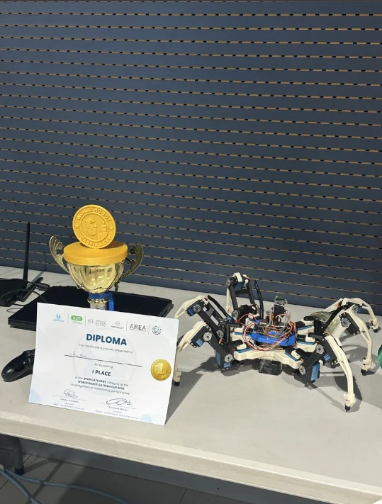

# AgriHexa

A six-legged agricultural robot: custom carbon-fiber hexapod chassis,
dual-MCU control/kinematics stack, IMU-stabilized walking, and
satellite-image path planning for autonomous fieldwork. Originally
based on the open-source [Make Your Pet](https://github.com/makeyourpet)
platform, substantially redesigned and re-engineered for planting and
terrain navigation.

## Achievements

🏆 **1st Place, Open Category — WRCC 2026**, for outstanding autonomous
performance.



## Features

- **Planting mechanism** — deploys small (3–5 mm radius) circular
  seeds/plants in a hummus-like growing medium as the robot traverses
  a field.
- **IMU-stabilized walking** — a BNO055 IMU feeds dual PID loops
  (pitch/roll) so the body stays level while walking or standing on
  uneven ground.
- **Autonomous terrain navigation** — an A* planner turns a satellite
  image (e.g. a Google Maps screenshot) into a terrain-cost grid,
  lets an operator drop multiple waypoints, and routes the robot along
  the path with the least incline/decline and roughest terrain.
- **Dual-MCU control** — an ESP32 handles Wi-Fi, PS4 teleop, and IMU
  stability; a Servo2040 (RP2040) is dedicated to per-leg inverse
  kinematics and gait generation.
- **Carbon-fiber legs with steel servo horns**, driven by 18x DS3235
  servos (3 per leg x 6 legs).

## Architecture

```
Satellite image ──▶ [navigation] A* planner ──Wi-Fi (TCP)──▶ [firmware] ESP32
                                                                   │  control + IMU PID
                                                                   │  UART (RobotState)
                                                                   ▼
                                                        [kinematics] Servo2040
                                                          IK solve + gait ──▶ 18x DS3235
```

PS4 controller input always takes priority over autonomous commands —
touching the controller instantly cancels any in-progress autonomous
move.

## Media

<video src="media/videos/short-pitch.mp4" controls width="500"></video>
<video src="media/videos/stability-system.mp4" controls width="500"></video>

## Repository structure

| Path            | Contents                                                        |
|------------------|-------------------------------------------------------------------|
| [`/firmware`](firmware)     | ESP32 control MCU: Wi-Fi, PS4 teleop, BNO055 stability PID |
| [`/kinematics`](kinematics)   | Servo2040 MCU: per-leg inverse kinematics, tripod gait      |
| [`/navigation`](navigation)   | Satellite-image A* terrain path planner (ground station)    |
| [`/simulation`](simulation)   | MATLAB one-leg IK visualizer; full hexapod Simscape model in progress |
| [`/hardware`](hardware)     | BOM (CAD and wiring diagram to follow)                       |
| [`/docs`](docs)         | [Design differences from Make Your Pet](docs/design-differences.md) |
| [`/media`](media)        | Photos and demo videos                                            |

## Getting started

1. **Firmware (ESP32)** — see [`firmware/README.md`](firmware/README.md)
   for wiring, the `secrets.h` setup, and PlatformIO build steps.
2. **Kinematics (Servo2040)** — see
   [`kinematics/README.md`](kinematics/README.md) for the leg model,
   gait, and CMake/Pico SDK build steps.
3. **Navigation (ground station)** — see
   [`navigation/README.md`](navigation/README.md) to run the A*
   satellite planner.
4. **Simulation** — see [`simulation/README.md`](simulation/README.md)
   for the MATLAB one-leg IK visualizer.

## Credits

- IK/gait approach adapted from the open-source
  [Make Your Pet](https://github.com/makeyourpet) hexapod platform.
- Built by [6abash](https://github.com/6abash).

## License

[MIT](LICENSE)
